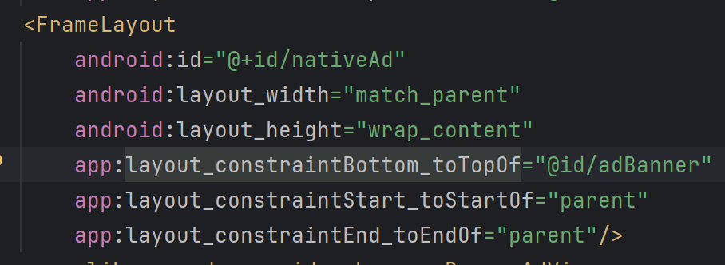
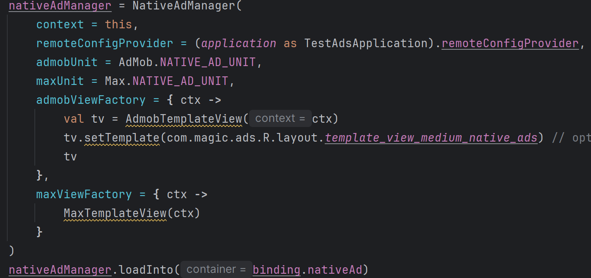
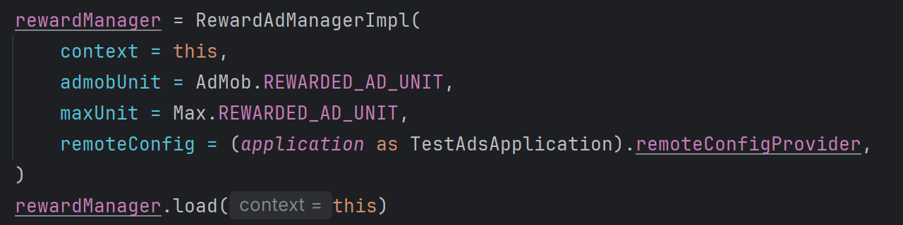
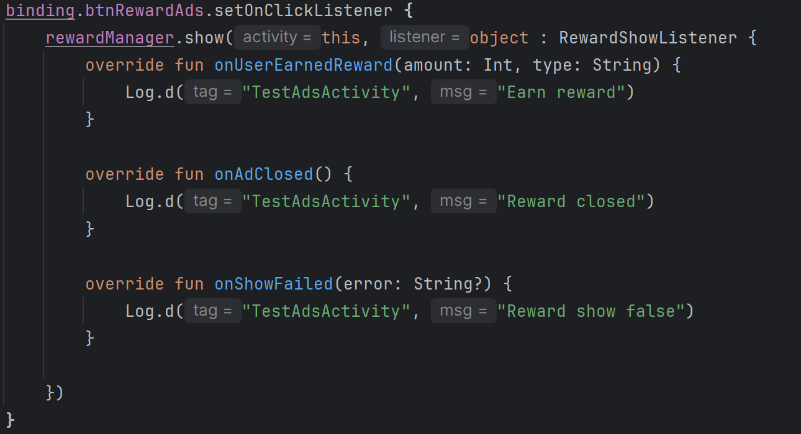

# android-ads
* *Native Ads*
* 
**1. Thêm vào layout XML**

Chèn FrameLayout vào file layout của Activity/Fragment:

Lưu ý: bạn có thể đổi ConstraintLayout attributes tùy vào parent layout của bạn.

**2. Khởi tạo trong Activity / Fragment**

Ví dụ khởi tạo NativeAdManager và load vào container (binding.nativeAd):

Giải thích ngắn:

admobViewFactory / maxViewFactory: factory để trả về View hiển thị quảng cáo tương ứng.

AdmobViewFactory:
    Sử dụng template có sẵn là AdmobViewTemplate và
        setTemplate(...): Có thể sử dụng 3 template có sẵn trong thư viện là template_view_large_native_ads, template_view_medium_native_ads, template_view_small_native_ads
        hoặc có thể custom layout theo design từ module app rồi truyền vào
    Tạo 1 view class kế thừa AdMobNativeViewBinder( thay cho AdobTemplateView)   
MaxViewFactory:
    - Sử dụng MaxTemplateView
    - Tạo class kế thừa MaxNativeViewBinder(thay cho MaxTemplateView)
loadInto(...): method để NativeAdManager tự thêm view quảng cáo vào container.

**3. Xử lý onDestroy — giải phóng tài nguyên quảng cáo**

Khi Activity/Fragment bị huỷ, cần gọi destroy() cho các view quảng cáo con (nếu view đó có API destroy) để tránh leak memory:

* *Reward Ads*
* 
Khởi tạo ở activity
  
Show reward
  
